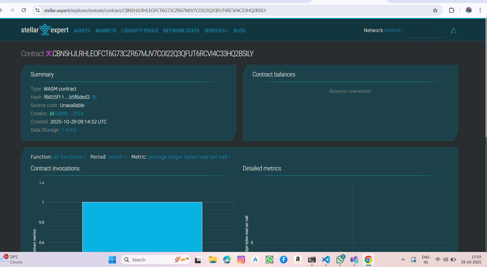

# Proof of Existence

## Project Title
Proof of Existence - Blockchain Document Timestamping Service

## Project Description
Proof of Existence is a decentralized smart contract built on the Stellar blockchain using Soroban SDK that enables users to cryptographically timestamp and prove the existence of documents at specific points in time. By storing document hashes (not the documents themselves) on the blockchain, users can establish immutable proof that a document existed at a particular timestamp without revealing the document's contents.

The smart contract provides a simple yet powerful interface to register document hashes with blockchain timestamps, verify document existence, retrieve proof records, and track statistics of registered documents. This solution is ideal for copyright protection, intellectual property claims, legal document verification, academic paper timestamping, and any scenario where proving document existence at a specific time is crucial.

## Project Vision
Our vision is to create a trustless, decentralized infrastructure for document verification that empowers individuals and organizations to establish indisputable proof of document existence without relying on centralized authorities. 

By leveraging blockchain technology, we aim to:

- **Democratize Trust** - Enable anyone, anywhere to prove document ownership and existence without intermediaries
- **Ensure Immutability** - Provide tamper-proof records that cannot be altered or backdated
- **Protect Privacy** - Store only cryptographic hashes, ensuring document contents remain private
- **Foster Innovation** - Create a foundation for decentralized notarization, copyright protection, and legal verification services
- **Build Accessibility** - Offer a simple, cost-effective alternative to traditional notarization and timestamping services

We envision a future where blockchain-based proof of existence becomes the standard for document verification across industries, from creative arts to legal systems, scientific research to business transactions.

## Key Features

### Document Registration
Register documents by their SHA-256 hash with automatic blockchain timestamping using ledger time. Associate owner address with each document and add optional descriptions for document metadata. The system prevents duplicate registrations for the same hash, ensuring unique proof records.

### Document Verification
Instantly verify if a document hash exists in the registry and retrieve complete proof records including timestamp and owner information. The verification process returns proof with all metadata for comprehensive validation purposes.

### Proof Retrieval
Query document proofs by their hash to access complete document metadata. Retrieve registration timestamp for temporal verification and view owner information for authenticity checks.

### Statistics Tracking
Monitor total number of registered documents and track system usage and growth. The statistics feature provides transparency into platform adoption and enables analytics and reporting capabilities.

### Privacy-Preserving Design
Only document hashes are stored on-chain, meaning original documents never leave the user's possession. This zero-knowledge proof of existence approach ensures that owner information is stored as provided by the user while maintaining complete privacy.

### Immutable Records
Once registered, proofs cannot be altered thanks to blockchain-backed timestamp integrity. The system provides permanent storage with configurable TTL and cryptographically secure verification.

## Future Scope

### Phase 1: Enhanced Functionality
Implement multi-signature support to enable multiple parties to co-sign document proofs for collaborative verification. Add batch registration capability allowing users to register multiple documents in a single transaction. Expand metadata support for additional fields like document type, category, and custom tags. Implement event emissions for real-time notifications on registration and verification activities.

### Phase 2: Advanced Features
Develop access control lists to implement permission systems controlling who can view specific proof records. Create document update mechanisms to link updated versions of documents to original proofs. Build revocation system allowing owners to revoke or invalidate document proofs with appropriate verification. Develop integration API with REST wrapper for easier integration with existing applications.

### Phase 3: Ecosystem Expansion
Integrate NFT capabilities to convert document proofs into NFTs for enhanced ownership representation. Build cross-chain bridges to enable proof verification across multiple blockchain networks. Connect with decentralized storage solutions like IPFS or Arweave for optional document storage. Develop mobile applications for iOS and Android enabling on-the-go document registration.

### Phase 4: Enterprise & Legal Integration
Create enterprise solutions with custom implementations for corporate document management systems. Partner with legal institutions for recognized digital notarization services. Implement AI-powered verification for document similarity detection and fraud prevention. Add compliance tools for regulatory requirements including KYC and AML in regulated industries.

### Phase 5: Governance & Community
Introduce governance token for community-driven protocol upgrades and feature development. Implement on-chain dispute resolution and arbitration for conflicting ownership claims. Develop time-lock mechanisms allowing scheduled document reveals for time-sensitive proofs. Partner with universities for research paper timestamping and plagiarism prevention systems.

### Research & Innovation Initiatives
Explore zero-knowledge proofs for enhanced privacy in document verification. Investigate quantum-resistant hashing algorithms to future-proof the system. Research efficient storage mechanisms for large-scale adoption across industries. Study integration possibilities with decentralized identity systems and verifiable credentials.

## Contract Details
CBN5HJLRHLEOFCT6G73CZR67MJV7COI22Q3QFUT6RCVI4C33HQ2BSILY

